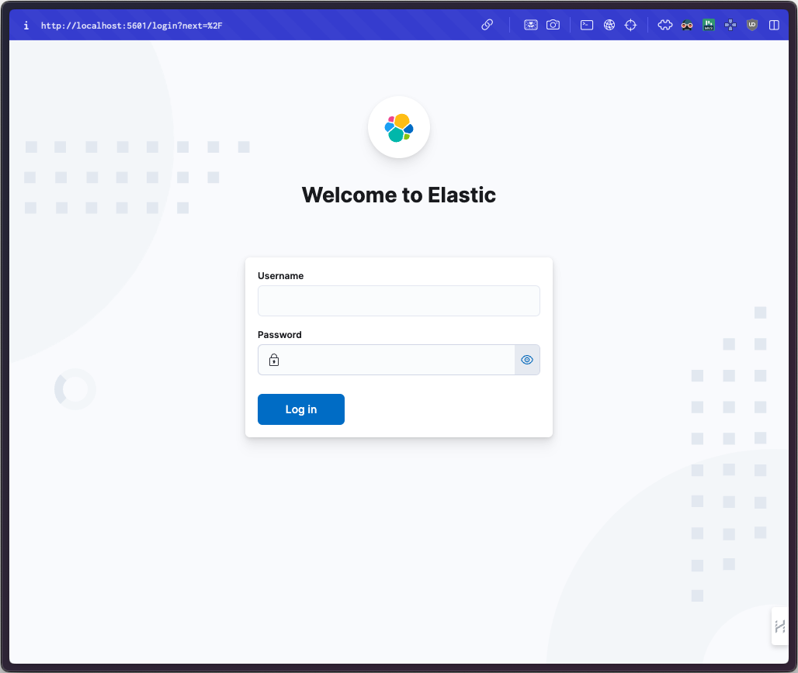
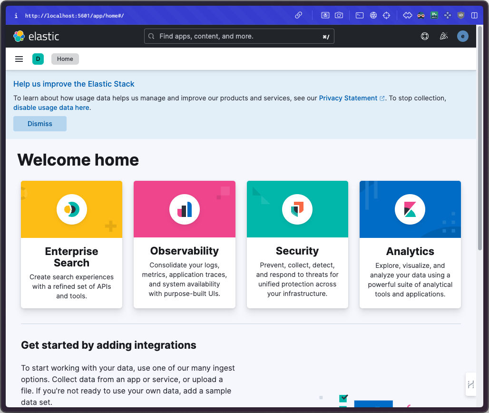

# Elastic Stack on GKE

## Requirements:
Google Cloud Platform:
- folder ID
- billing ID
- Service Account Key

Local machine:
- gcloud CLI
- kubectl CLI
- helm CLI
- git CLI
- terraform CLI

## Clone this repo

```sh
git clone https://github.com/froggologies/gcp-terraform-exp-elastic.git && cd gcp-terraform-exp-elastic
```

## Set environment variables:

```sh
export GOOGLE_APPLICATION_CREDENTIALS=<PATH_TO_SERVICE_ACCOUNT_KEY>
export TF_VAR_billing_account=<BILLING_ACCOUNT_ID>
export TF_VAR_folder_id=<FOLDER_ID>
```

## Provision resources

> Change the backend in `terraform/backend.tf` to your backend configuration or delete it if you want to use local backend.

Initialize Terraform:
```sh
terraform -chdir=terraform init
```

Apply Terraform:
```sh
terraform -chdir=terraform apply
# Apply complete! Resources: 18 added, 0 changed, 0 destroyed.
```

Make sure use that we use the correct context
```sh
kubectl config get-contexts
```

If not then get the cluster credentials:
```sh
gcloud container clusters get-credentials <cluster-name> --zone <zone-location> --project <project-id>
```


## Elastic Cloud on Kubernetes

If you are using GKE, make sure your user has cluster-admin permissions.

1. Install custom resource definitions:
```sh
kubectl create -f https://download.elastic.co/downloads/eck/2.11.1/crds.yaml
```

2. Install the operator with its RBAC rules:
```sh
kubectl apply -f https://download.elastic.co/downloads/eck/2.11.1/operator.yaml
```
we can find more information regarding ECK [elastic web](https://www.elastic.co/guide/en/cloud-on-k8s/master/k8s-deploy-eck.html) and [elastic github](https://github.com/elastic/cloud-on-k8s/tree/main)


## Install Elasticsearch

1. Create an efk namespace:
```sh
kubectl apply -f efk-namespace.yaml
```
- switch context to efk namespace
  ```sh
  kubectl config set-context <context-name> --namespace=efk
  ```
2. Apply Manifest for Elasticsearch
```sh
kubectl apply -f ElasticSearch.yaml
```

3. WATCH Status of Elasticsearch
```sh
watch "kubectl get elasticsearch -n efk"
```

```
NAME            HEALTH   NODES   VERSION   PHASE   AGE
elasticsearch   green    1       8.13.0    Ready   2m6s
```
- exit using `ctrl+c`

4. Validation 
- Export password
```sh
PASSWORD=$(kubectl get secret elasticsearch-es-elastic-user -o go-template='{{.data.elastic | base64decode}}')
``` 
- From your local workstation, use the following command in a separate terminal
```sh
kubectl port-forward service/elasticsearch-es-http 9200
```

- Then request `localhost`:
```sh
curl -u "elastic:$PASSWORD" -k "https://localhost:9200"
```
- - - validated like this :tada:
```
  $ curl -u "elastic:$PASSWORD" -k "https://localhost:9200"
{
  "name" : "elasticsearch-es-default-0",
  "cluster_name" : "quickstart",
  "cluster_uuid" : "zliKMgaPRzCmy6N1bJc4jw",
  "version" : {
    "number" : "8.13.0",
    "build_flavor" : "default",
    "build_type" : "docker",
    "build_hash" : "09df99393193b2c53d92899662a8b8b3c55b45cd",
    "build_date" : "2024-03-22T03:35:46.757803203Z",
    "build_snapshot" : false,
    "lucene_version" : "9.10.0",
    "minimum_wire_compatibility_version" : "7.17.0",
    "minimum_index_compatibility_version" : "7.0.0"
  },
  "tagline" : "You Know, for Search"
}
```

## Deploy Kibana

1. Apply Manifest for Kibana
```sh
kubectl apply -f Kibana.yaml
```
2. Watch Status of Kibana
```sh
watch "kubectl get kibana -n efk"
```
```
NAME     HEALTH   NODES   VERSION   AGE
kibana   green    1       8.13.0    11m
```
- exit using `ctrl+c`
3. validation access to kibana 
- get service
```sh
kubectl get svc kibana-kb-http -n efk
```

- Use kubectl port-forward to access Kibana from your local workstation:
```sh
kubectl port-forward service/kibana-kb-http 5601
```
- access
[localhost:5601](http://localhost:5601/)

- Login as the `elastic` user. The password can be obtained with the following command:
```sh
kubectl get secret elasticsearch-es-elastic-user -o=jsonpath='{.data.elastic}' | base64 --decode; echo
```


<!-- 
 -->

<div align="center">
  
  
</div>


> [!TIP]
> Use gateway or ingres for exposing kibana [here](https://github.com/elastic/cloud-on-k8s/tree/2.12/config/recipes/istio-gateway)


## Install Fluent-bit

```sh
helm repo add fluent https://fluent.github.io/helm-charts
```
```sh
helm upgrade --install fluent-bit fluent/fluent-bit -n efk -f fluent-bit-values.yaml
```
